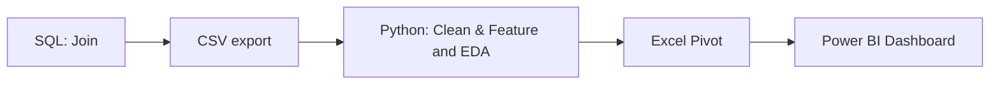

 E‑Commerce Analytics — SQL → Python → Excel → Power BI

**Single‑project portfolio**  โดยผมเริ่มจาก *SQL join* → *Python data cleaning* → *Excel Pivot* → *Power BI dashboard* 
<div align="left">
  
 
 
 


</div>

## ขั้นตอนการทำ
- **SQL data model**: รวมข้อมูลคำสั่งซื้อ ลูกค้า สินค้า รายการสั่งซื้อ และงบโฆษณา เข้าด้วยกัน (ดู `sql/01_ecom_join.sql`)
- **Python cleaning pipeline**: Data Cleaning โดยตั้งชื่อคอลัมน์ให้มาตรฐาน, แปลงวันที่, บังคับชนิดข้อมูล, ลบค่าซ้ำและเพิ่มฟีเจอร์เวลา
-                               และ EDA โดยใช้ library Pandas,Numpy,Matplotlib (ดู `src/ecom_clean.py`)
- **Excel Pivot workbook**: ใช้ทำ quick slice & dice ก่อนส่งเข้า Power BI
- **Power BI dashboard**: KPI cards + เทรนด์รายเดือน  + ช่องทาง/วิธีชำระ + Top 10 จากสินค้าทั้งหมด

## Process


## 📁 Repository structure
```
ecom-analytics-portfolio/
├─ sql/
│  └─ 01_ecom_join.sql
├─ src/
│  └─ ecom_clean.py
├─ data/
│  └─ sample/
│     ├─ ยอดขาย TOP10.csv
│     ├─ ยอดขายตามวิธีชำระxช่องทาง.csv
│     └─ ยอดขายรายเดือนxหมวดสินค้า.csv
      └─ 
├─ docs/
│  ├─ ONE-PAGER.md
│  └─ figs/
│     ├─ Mothly Orders & Revenue.png
│     ├─TOP 10 Product.png
│     └─ Top Categories by Revenue.png
      └─ Top Channels by Revenue.png
└─ README.md
```


## 🧠 Problem framing
- เป้าหมาย: รู้ว่า **ยอดขายมาจากไหน ลดลง/เพิ่มขึ้นเพราะอะไร** เพื่อนำไปปรับกลยุทธ์การตลาดให้องค์กรมีประสิทธิภาพมากยิ่งขึ้น
- แกนวิเคราะห์: ช่องทางการขาย, วิธีชำระ, หมวดสินค้า, เทรนด์เดือน, Top 10 รายการ
- KPI หลัก: Revenue, Orders, Units, AOV และ ROAS


— _Made with ❤️ by a Data Analyst intern (Economics major)_
