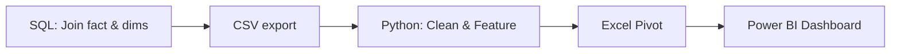
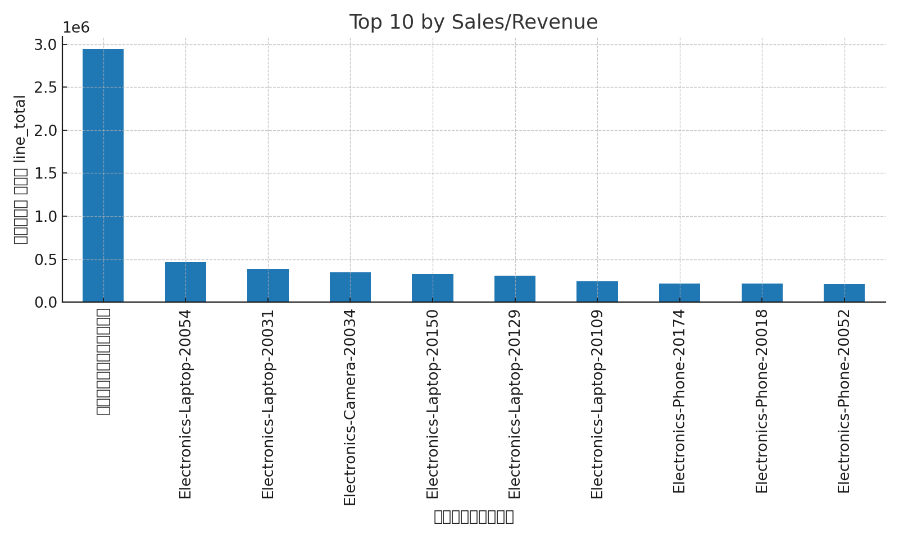

# E‑Commerce Analytics — SQL → Python → Excel → Power BI

**Single‑project portfolio** ที่โชว์ครบทั้งสาย data: เริ่มจาก *SQL join* → *Python data cleaning* → *Excel Pivot* → *Power BI dashboard* ในโจทย์อีคอมเมิร์ซจริง ๆ (สังเคราะห์โครงจากตารางมาตรฐาน orders, customers, products ฯลฯ)

<div align="left">
  
 
 
 


</div>

## 🎯 What I built
- **SQL data model**: รวมข้อมูลคำสั่งซื้อ ลูกค้า สินค้า รายการสั่งซื้อ และงบโฆษณา เข้าด้วยกัน (ดู `sql/01_ecom_join.sql`)
- **Python cleaning pipeline**: ตั้งชื่อคอลัมน์ให้มาตรฐาน, แปลงวันที่, บังคับชนิดข้อมูล, ตัดซ้ำ และเพิ่มฟีเจอร์เวลา (ดู `src/ecom_clean.py`)
- **Excel Pivot workbook**: ใช้ทำ quick slice & dice ก่อนส่งเข้า Power BI
- **Power BI dashboard**: KPI cards + เทรนด์รายเดือน + Breakdown ช่องทาง/วิธีชำระ + Top 10 สินค้า/หมวด

## 🗺️ Pipeline (Mermaid)


## 📁 Repository structure
```
ecom-analytics-portfolio/
├─ sql/
│  └─ 01_ecom_join.sql
├─ src/
│  └─ ecom_clean.py
├─ data/
│  └─ sample/
│     ├─ top10_sales.csv
│     ├─ sales_by_payment_channel.csv
│     └─ monthly_sales_by_category.csv
├─ docs/
│  ├─ ONE-PAGER.md
│  └─ figs/
│     ├─ top10.png
│     ├─ by_category.png
│     └─ trend.png
├─ .gitignore
├─ requirements.txt
├─ LICENSE
└─ README.md
```

## 🔎 Highlights
- **Reproducible by design**: โค้ดแยกชัดเจน (SQL / Python) พร้อมตัวอย่างข้อมูลใน `data/sample/`
- **Metric hygiene**: บังคับชนิดข้อมูล + ฟีเจอร์วันที่ + ตรวจซ้ำ เพื่อใช้คำนวณ KPI ได้เสถียร
- **HR‑friendly visuals**: แปะภาพหลักไว้ใน `docs/figs/` และสรุปหนึ่งหน้าใน `docs/ONE-PAGER.md`

## 📊 Quick look
<p align="left">
  
  
</p>

> หมายเหตุ: รูปสร้างจากชุดตัวอย่างใน `data/sample/` เพื่อแสดงรูปแบบการนำเสนอ (ไม่ใช่ข้อมูลจริงของบริษัทใด)

## ▶️ How to run
```bash
# 1) สร้าง virtual env และติดตั้งไลบรารี
pip install -r requirements.txt

# 2) รันขั้นตอน clean (ผลลัพธ์: ecom_cleaned_ready.csv)
python src/ecom_clean.py

# 3) เปิด Excel/Power BI แล้วเชื่อมกับ ecom_cleaned_ready.csv หรือไฟล์ตัวอย่างใน data/sample/
```

## 🧠 Problem framing
- เป้าหมาย: รู้ว่า **ยอดขายมาจากไหน ลดลง/เพิ่มขึ้นเพราะอะไร** และแนะนำ action ได้
- แกนวิเคราะห์: ช่องทางการขาย, วิธีชำระ, หมวดสินค้า, เทรนด์เดือน, Top 10 รายการ
- KPI หลัก: Revenue, Orders, Units, AOV, (ROAS หากมี `ad_spend`)

## 🪄 SQL snapshot
ดูไฟล์เต็มใน `sql/01_ecom_join.sql` — ตัวอย่างแนวรวมตารางหลักและเสริม (ad_spend) ด้วย LEFT JOIN ตามเดือน

## 📌 Notes
- Repository นี้ไม่รวมไฟล์ข้อมูลที่มีความอ่อนไหว ใช้เพียงตัวอย่างเพื่อสาธิต workflow
- หากต้องการรันกับข้อมูลจริง ให้ปรับ path/การเชื่อมต่อใน `src/ecom_clean.py`

— _Made with ❤️ by a Data Analyst intern (Economics major)_
